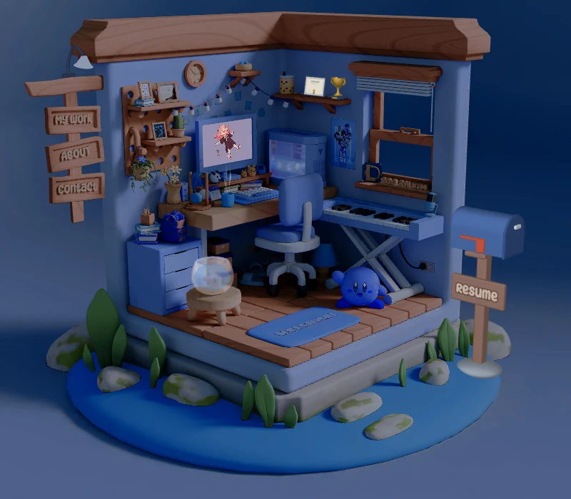
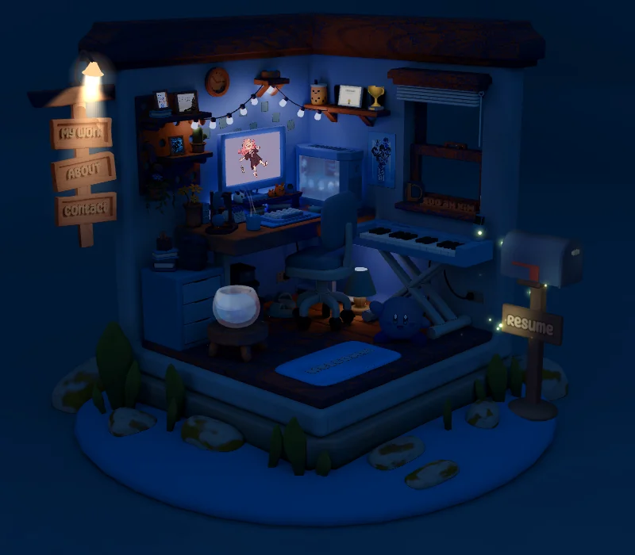
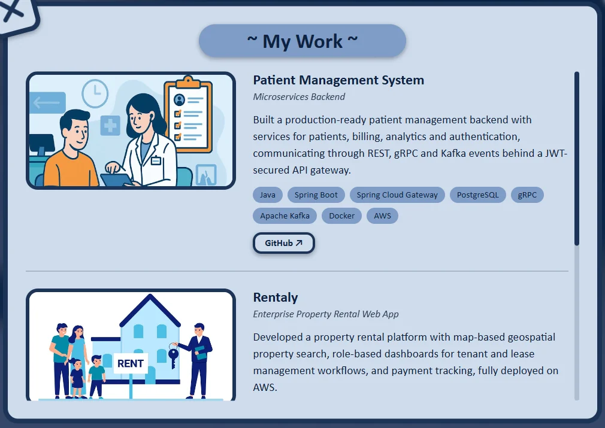
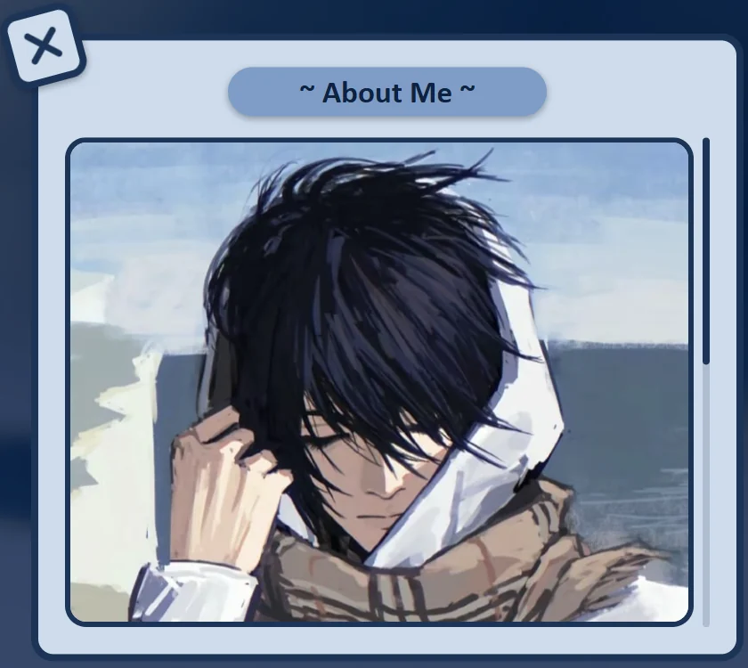

# 💙 Thenuja's Room Folio 💙

**[Live site: thenujahansana.dev](https://thenujahansana.dev)**

My interactive 3D portfolio: a cozy little room you can spin around, click through and play the piano in. It has my projects, a bit about me, my CV and all the ways to reach me.



## What's inside

- **My Work, About and Contact:** click the hanging sign on the left of the room
- **Resume:** click the mailbox outside the room to read my CV or download it
- **Day and night mode:** at night a lamp lights up the sign and fireflies light up the mailbox
- **A playable piano:** click the keys and play a song
- Works on desktop and phones (drag with one or two fingers to move around)

| Night mode | My Work |
| :---: | :---: |
|  |  |



## Built with

[Three.js](https://threejs.org/), [Vite](https://vite.dev/), [GSAP](https://gsap.com/), [Howler.js](https://howlerjs.com/), [PDF.js](https://mozilla.github.io/pdf.js/) and Sass. The room was modelled and baked in Blender (source files in `blender files/`).

## Running it locally

```
npm install
npm run dev
```

`npm run build` makes the production build in `dist/`.

## Where things live

| To change | Edit |
| --- | --- |
| Text in the pop-ups (My Work, About, Contact, Resume) | `index.html` |
| The CV shown in the Resume pop-up | `public/media/Thenuja_Hansana_Resume.pdf` |
| Colours of the page and pop-ups | the palette at the top of `src/style.scss` |
| Colours of the 3D room (`?debug` on the URL gives live sliders) | `ROOM_GRADE` in `src/main.js` |
| The sign lamp | `SIGN_LAMP` in `src/main.js` |
| Background music | `public/audio/music/`, loaded at the top of `src/main.js` |

## Credits

This portfolio is built on **Andrew Woan's [sooahs-room-folio](https://github.com/andrewwoan/sooahkimsfolio)**, including its room, art and design, used under the MIT license (see `LICENSE.md`). Check out his [YouTube channel](https://www.youtube.com/@andrewwoan) and his [tutorial on building a room like this](https://youtu.be/AB6sulUMRGE). The original won awards on [Awwwards](https://www.awwwards.com/sites/suas-room-folio) and [CSSDA](https://www.cssdesignawards.com/sites/sooahs-room-folio/47040/).

Assets and inspiration from the original project:

- [Bruno Simon's Room](https://my-room-in-3d.vercel.app/) and [Rachel Wei's Room](https://rachelqrwei.ca/)
- [Nicky Blender](https://www.instagram.com/nicky.blender/?hl=en)
- [Denis Wipart's Materials](https://wipart.artstation.com/store)
- [Click SFX](https://uppbeat.io/sfx/category/digital-and-ui/ui) and [Piano SFX](https://pixabay.com/sound-effects/all-88-keys-on-a-piano-playing-fast-free-high-quality-sound-effects-71279/)
- [Cat Wallpaper](https://wallpapersok.com/wallpapers/kawaii-hd-smiling-cats-vmhjik4wp6ipc6bd.html), [Peach Panda Wallpaper](https://4kwallpapers.com/cute/peach-cat-kawaii-10081.html) and [Anya Forger Wallpaper](https://www.uhdpaper.com/2022/03/anya-forger-spy-x-family-4k-5061g.html?m=0)
- [SVGs](https://www.svgrepo.com/) and the [Motley Forces font](https://www.fontspace.com/niskala-huruf) (on the mailbox sign)

Added for this version:

- [Carlito](https://fonts.google.com/specimen/Carlito) font, a free match for Calibri (OFL)
- X icon from [Tabler Icons](https://tabler.io/icons) (MIT)
